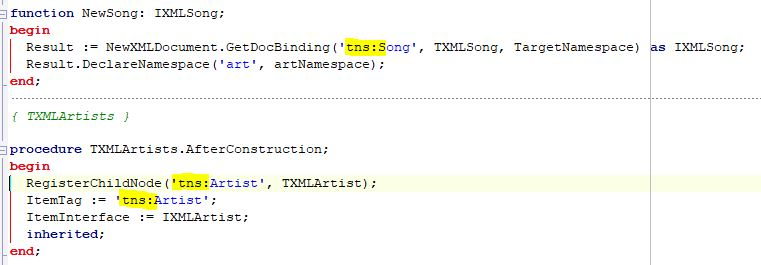

# XMLDataBindingFix for Delphi version 0.1 license MIT

## Usage: XMLDataBindingFix [-NS:namespace] [-RTTI] PasFileName

**Available options:**
  * -NS            NameSpace prefix
  * -RTTI          Copy property from interace to class for rtti access
  * -PasFileName   XML Data Binding pas file

```
Example: XMLDataBindingFix -NS:tns -RTTI XSD.pas
```

